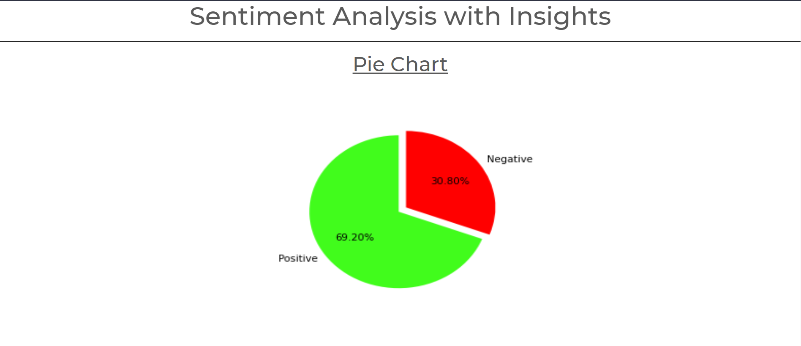
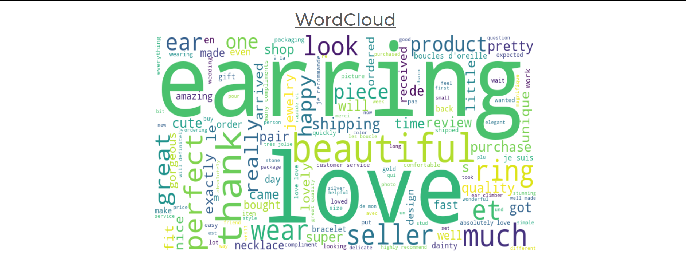
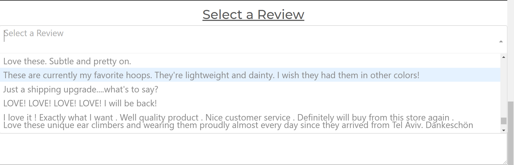
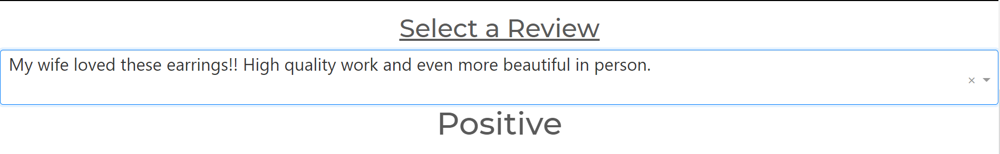
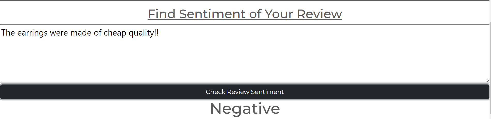

# Sentiment-Analysis
Sentiment-Analysis is where a ML model identifies a statement's sentiment - positive or negative. In this project, I have used Logistic Regression to carry out the sentiment analysis and have also deployed it using the Dash library in python. The model was trained with data taken from amazon's website, click [here](http://deepyeti.ucsd.edu/jianmo/amazon/categoryFiles/Clothing_Shoes_and_Jewelry.json.gz) to download the data. Data was also scrapped from the client website, click [here](https://www.etsy.com/) to go to the website.
---

# Requisites
-> Pandas library -> sklearn library -> numpy library -> nltk library -> regex library -> pickle library -> selenium library -> web driver for your browser -> Dash library
---

# Features
1. The UI has a pie chart indicating the percentage of positive and negative reviews.

---
2. Word cloud for decorative purposes.

---
3. A drop down menu containing the reviews I had scrapped from the etsy website.

---
4. It also predicts if the review selected from the drop down menu is a positive review or a negative review.

---
5. There is an additional feature where the user can type in their own review and check wether the statement is a positive one or a negative one.

---
# Environment.
Spyder (python 3.8)
---
